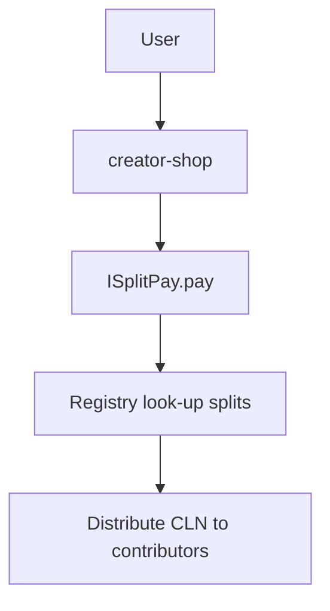

# Clean Web Economy — Developer‑Friendly Spec v0.2

**Author:** Roland Nagtegaal & ChatGPT (GPT-5)

**Status:** Draft for implementation

**Purpose:** Provide concrete interfaces, pseudocode, example transactions, schemas, and test scaffolding for implementing the Clean Web Economy (CWE). Complements the Systems Engineering spec and Governance Charter.

---

## 0. Quick Map of Codebases (Modules)

* `clients/browser-ext/` — WebExtensions plugin (Chromium/Firefox)
* `clients/player-plugin/` — VLC/FFmpeg plugin + mobile SDK
* `libs/fingerprint/` — Perceptual A/V fingerprinting (WASM + native)
* `libs/wallet-zk/` — Wallet, tier contracts, ZK consumption proofs
* `chain/contracts/` — Smart contracts (Solidity or Substrate pallets)
* `infra/storage/` — IPFS/Torrent integration layer + gateway
* `infra/dmf/` — Distributed Microservices Fabric templates & registry
* `services/creator-portal/` — Work signing, splits, pricing, catalog
* `services/discovery-hub/` — Search, ranking by reputation/tags
* `services/governance/*` — From Technical Governance Spec

---

## 1. Browser Extension (WebExtensions)

### 1.1 Core Responsibilities

* Recognize content (page audio/video) → `work_id`
* Enforce user price threshold; block/allow playback
* Log local consumption time; generate ZK summary
* Submit monthly payout proof → chain contract

### 1.2 Content Recognition Flow (pseudocode)

```ts
// content-script.ts
onMediaPlay(async mediaEl => {
  const samples = await tapAudioVideo(mediaEl);      // Float32Array frames
  const fp = await Fingerprint.compute(samples);     // WASM module
  const work = await hub.resolveFingerprint(fp);     // returns {work_id, price_per_min, region_factor}

  if (!policy.allows(work.price_per_min, user.threshold)) {
    ui.blockPlayback(mediaEl, reason="Price cap exceeded");
    return;
  }

  const sessionId = uuid();
  SessionStore.start(sessionId, work.work_id);
});

onMediaProgress(({sessionId, dt}) => {
  SessionStore.addTime(sessionId, dt); // local only
});

onMediaStop(({sessionId}) => {
  SessionStore.stop(sessionId);
});
```

### 1.3 Monthly Settlement (ZK proof skeleton)

```ts
// background.ts
cron.monthly(async () => {
  const usage = SessionStore.flush(); // [{work_id, minutes}]
  const pub = usage.map(x => ({work_id: x.work_id, minutes_commit: commit(x.minutes)}));
  const proof = await ZK.generateProof(usage); // proves minutes sum & per-work mapping

  await chain.CWE.submitConsumption({
    userTier: wallet.tier(),
    commitments: pub,
    proof,
  });
});
```

### 1.4 Permissions & Security

* Minimal host permissions; optional per-site opt-in
* Code signing; reproducible build; CSP strict

---

## 2. Media Player Plugin (VLC/FFmpeg)

### 2.1 Hook Points

* Demuxer/decoder taps to extract frames → `libs/fingerprint`
* Playback events start/stop → local time accounting
* Network I/O integrates IPFS gateway

### 2.2 Pseudocode (C-like)

```c
int cwe_on_play(MediaCtx *ctx) {
  fp_ctx_t *fp = fp_init();
  while (read_frame(ctx, &frame)) {
    fp_ingest(fp, frame.samples, frame.len);
    if (fp_ready(fp)) {
      fp_hash_t h = fp_finalize(fp);
      work_t w = hub_resolve(h);
      if (!policy_allows(w.price_per_min, user_threshold)) return BLOCK;
      account_session_start(ctx->session_id, w.id);
    }
    account_add_time(ctx->session_id, frame.duration_ms);
  }
  account_session_stop(ctx->session_id);
}
```

---

## 3. Fingerprint Library (`libs/fingerprint`)

### 3.1 API (TypeScript, WASM)

```ts
namespace Fingerprint {
  export function compute(samples: Float32Array, opts?: { kind: 'audio'|'video' }): Promise<string>; // returns FP_ID
  export function compare(a: string, b: string): number; // similarity score
}
```

### 3.2 Notes

* Audio: chroma + constellation map → robust hash
* Video: perceptual hash (pHash) + scene signature
* Output: 256-bit FP_ID; near-duplicate search via LSH

---

## 4. Wallet & ZK (`libs/wallet-zk`)

### 4.1 Interfaces

```ts
interface Tier {
  id: 'light'|'medium'|'heavy';
  monthly_fee_cln: bigint;
}

interface Wallet {
  address(): string;
  tier(): Tier;
  sign(msg: bytes): Signature;
}

namespace ZK {
  type Usage = { work_id: string, minutes: number }[];
  export function generateProof(usage: Usage): Promise<Proof>;
  export function verifyProof(commitments: any, proof: Proof): boolean;
}
```

### 4.2 Circuit Idea (high-level)

* Private inputs: per-work minutes vector
* Public outputs: commitments per work, total minutes by category
* Constraint: all minutes ≥ 0; sum within tier allowance

---

## 5. Smart Contracts (`chain/contracts`)

### 5.1 Solidity Interfaces (illustrative)

```solidity
interface ICWETiers {
  function feeOf(bytes32 tierId) external view returns (uint256);
}

interface ICWERegistry {
  function registerWork(bytes32 workId, address payable[] memory payees, uint96[] memory splits, uint256 pricePerMin, bytes32 regionRule) external;
}

interface ICWEConsumption {
  function submitConsumption(bytes32 userId, bytes32 tierId, bytes32[] calldata workCommitments, bytes calldata zkProof) external;
}

interface ICWEPayouts {
  function settleEpoch(uint256 epochId) external; // runs DAPR on aggregated proofs
}
```

### 5.2 Work Registration (Creator Portal → Registry)

```solidity
function registerWork(...) onlyVerifiedCreator {
  require(validSplits(payees, splits));
  works[workId] = Work(payees, splits, pricePerMin, regionRule);
  emit WorkRegistered(workId);
}
```

### 5.3 Settlement Pseudocode (off-chain job + on-chain commit)

```python
# offchain_dapr.py
usage = pull_commitments(epoch)
# reconstruct weighted values Vi = minutes_i * price_i * region_factor
for user in usage:
    D_total = sum(Vi for i in user.works)
    for i in user.works:
        Wi = Vi / D_total
        credit[i.work_id] += user.tier_fee * Wi

# commit batch roots
tx = cwepayouts.commit(epoch, merkle_root(credit_map))
```

### 5.4 On-Chain Split-Pay

```solidity
function withdraw(bytes32 workId) external {
  uint256 bal = credit[workId];
  for (uint i=0; i<works[workId].payees.length; i++) {
     uint256 share = bal * works[workId].splits[i] / 1e6;
     works[workId].payees[i].call{value: share}("");
  }
  credit[workId] = 0;
}
```

---

## 6. Storage & Distribution (`infra/storage`)

### 6.1 IPFS/Torrent Bridge

```bash
# pin a file and announce to DHT
ipfs add --pin movie.mkv
cwe-gateway seed movie.mkv.torrent --from-cid Qm...
```

### 6.2 Client Fetch (HTTP → IPFS)

```ts
const url = `https://gateway.cwe.net/ipfs/${cid}`;
const stream = await fetch(url);
player.play(stream.body);
```

---

## 7. DMF Microservices (`infra/dmf`)

### 7.1 Service Manifest (`service.yml`)

```yaml
name: creator-shop
version: 0.1.0
endpoints:
  - POST /orders {auth: oidc, scopes: [shop:order:create]}
  - GET  /catalog {public: true}
contracts:
  splitPay: cwe://contracts/split-pay@1.0
  escrow:   cwe://contracts/escrow@1.0
pricing:
  - type: subscription
    amount_cln: 3_000_000
    period: monthly
```

### 7.2 Split-Pay & Escrow (contract ABI snippets)

```solidity
interface ISplitPay { function pay(bytes32 workId) external payable; }
interface IEscrow { function open(bytes32 jobId, uint256 amount) external; function release(bytes32 jobId) external; }
```

### 7.3 Example Checkout Flow



---

## 8. Arbitration API

```http
POST /arb/cases
Body: { type: "impersonation", work_id, evidence: [CID...] }

POST /arb/cases/{id}/vote
Body: { choice: "uphold" | "reject" }

GET  /arb/cases/{id}
```

---

## 9. Discovery Hub API

```http
GET /search?q=ambient+guitar&tags=music
GET /works/{work_id}
GET /creators/{creator_id}
```

Ranking inputs: reputation, freshness (half-life), diversity, user filters.

---

## 10. Data Schemas (JSON)

### 10.1 Work Metadata

```json
{
  "work_id": "w:sha256:...",
  "title": "",
  "contributors": [{"id": "c:vc:...", "role": "composer", "share_ppm": 500000}],
  "price_per_min": 1200,
  "region_rule": "eu-tier-1",
  "fingerprints": ["fp:..."],
  "signatures": ["sig:..."],
  "tags": ["music", "ambient"],
  "created_at": "2025-10-01T12:00:00Z"
}
```

### 10.2 Consumption Commitment

```json
{
  "user": "u:zk:...",
  "epoch": 2025_11,
  "commitments": [{"work_id": "w:...", "minutes_commit": "cm:..."}],
  "zk_proof": "p:..."
}
```

---

## 11. Example End-to-End Transaction

1. **Creator** uploads track via Creator Portal → computes FP → signs metadata → `registerWork()` on-chain.
2. **User** plays track in browser → extension recognizes FP → checks price threshold.
3. Local **SessionStore** accrues minutes.
4. Month end: extension generates **ZK proof** & commitments → `submitConsumption()`.
5. Off-chain **DAPR job** aggregates proofs → computes allocations → commits Merkle root.
6. **Creators** call `withdraw(workId)`; splits auto-disperse to contributors.

---

## 12. Local Dev Environment

```bash
# chain
make chain-dev   # launches Anvil/Hardhat or Substrate local node
make deploy      # deploys contracts

# services
docker compose -f dev/docker-compose.yml up

# browser extension
pnpm -C clients/browser-ext dev

# player plugin
make -C clients/player-plugin vlc
```

---

## 13. Testing Strategy

* Unit tests: fingerprint collisions, price-threshold logic, ZK proof verification
* Property tests: DAPR fairness invariants (sum of allocations == sum of fees)
* Integration: end-to-end monthly cycle in devnet
* Security: fuzzing of smart contracts; bounty program

---

## 14. Open Questions for Dev

* Finalize ZK circuit scope (per-work vs per-category commitments)
* Decide EVM vs Substrate pallets for v1
* Standardize FP format and LSH index API
* Define gateway trust policy (pinning, rate limits)

---

**End of v0.2**

> When you’re ready, we can scaffold the repos with this layout and generate starter code (contract interfaces, OpenAPI specs, extension boilerplate).

