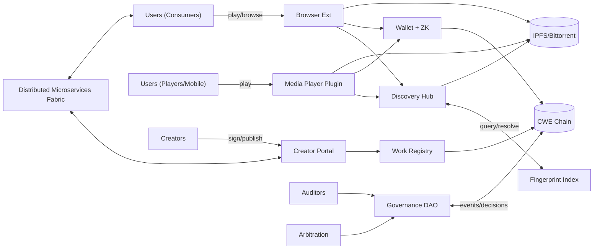
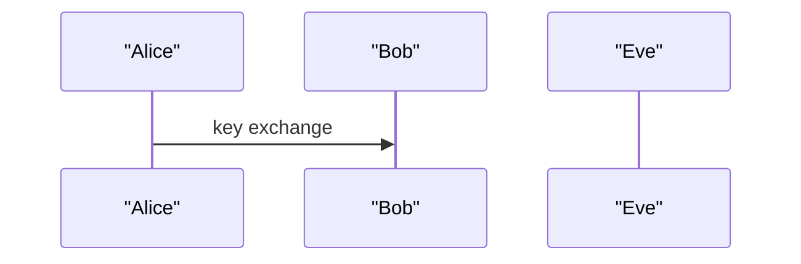
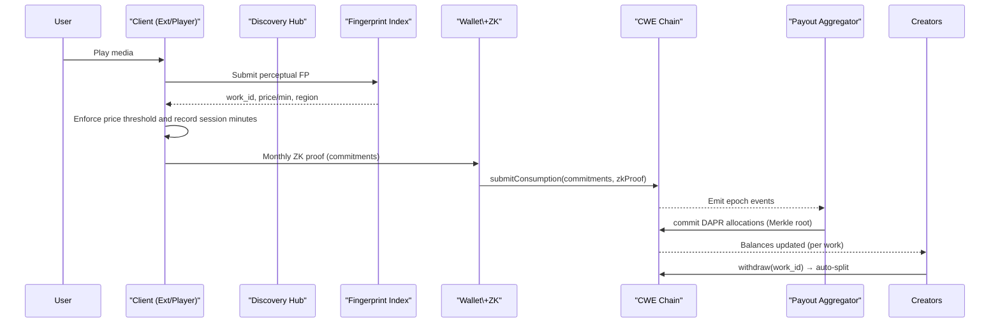
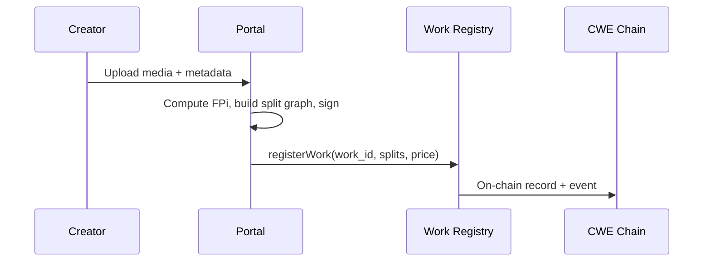
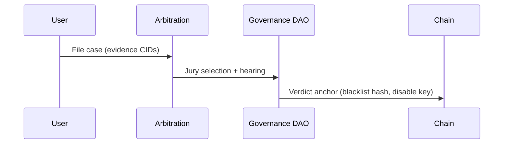

# Clean Web Economy — Technical Architecture Blueprint v0.1

**Author:** Roland Nagtegaal & ChatGPT (GPT-5)

**Status:** Draft for architecture review

**Purpose:** Macro-level blueprint that ties together all CWE subsystems—clients, storage, chain, governance, DMF—showing roles, data flows, trust boundaries, deployment views, and scaling concerns.

---

## 1. System Context

**Narrative:** Consumers use clients (browser/player) that recognize content, enforce price thresholds, and create private usage proofs. Creators register signed works via the portal. Discovery Hub mediates search and fingerprint resolution. Chain handles tiers, proofs, payouts, and governance events. Storage is decentralized (IPFS/Torrent). DMF offers creator-centric microservices (shops, tickets, communities).

---

## 2. Roles & Node Types

| Role / Node                     | Responsibility                                       | Trust Level                             |
| ------------------------------- | ---------------------------------------------------- | --------------------------------------- |
| **Client (Browser/Player)**     | Recognition, local time accrual, ZK proof generation | Untrusted for claims; trusted for UX    |
| **Creator Node (Portal)**       | Work signing, pricing, splits; DMF integration       | Verified identity required              |
| **Discovery Hub**               | FP resolution, search/ranking; caches metadata       | Semi-trusted, content-addressed outputs |
| **Fingerprint Index**           | LSH near-duplicate search; anti-impersonation checks | Semi-trusted; verifiable outputs        |
| **Storage Node (IPFS/Torrent)** | Host media; serve chunks                             | Untrusted; integrity via CIDs           |
| **Chain Validator**             | Execute contracts, finalize state                    | Trusted via consensus                   |
| **Arbitration Nodes**           | Jury selection & verdict anchoring                   | Verified human jurors                   |
| **Auditor Nodes**               | Resource-back audits, code audits                    | Verified expert credentials             |
| **DMF Hosts**                   | Run microservices for creator economy                | Semi-trusted; OIDC + signed manifests   |

---

## 3. Data Flows (Primary)

### 3.1 Playback & Settlement

### 3.2 Work Registration

### 3.3 Moderation (Illegality)

---

## 4. Trust Boundaries & Security Zones

* **Zone A — Client Local State:** session minutes, raw consumption → never leaves device; only commitments do (ZK).
* **Zone B — Semi-Trusted Services:** Discovery Hub, FP Index, DMF apps → signed responses; clients verify.
* **Zone C — Consensus Layer:** Chain validators execute canonical logic (tiers, proofs, registry, payouts, governance).
* **Zone D — Storage Fabric:** Content-addressed payloads; clients verify CIDs; gateways are interchangeable.

**Controls:** mTLS across services, signed manifests (SBOM), reproducible builds, hardware-backed keys for creators, zero-knowledge proofs for privacy.

---

## 5. Interfaces & Protocols (Catalog)

| Interface              | Producer → Consumer          | Transport   | Auth                       | Integrity         |
| ---------------------- | ---------------------------- | ----------- | -------------------------- | ----------------- |
| **FP Resolve**         | Client → Discovery Hub/Index | HTTPS/GRPC  | API key/OIDC               | Signed JSON (JWS) |
| **Work Registry**      | Portal → Chain               | Tx RPC      | Creator VC → wallet        | Chain finality    |
| **Consumption Submit** | Client → Chain               | Tx RPC      | User wallet                | ZK proof verified |
| **Payout Commit**      | Aggregator → Chain           | Tx RPC      | Guardian multi-sig         | Merkle proof      |
| **Storage Fetch**      | Client → IPFS/Torrent        | HTTP/Libp2p | Public                     | CID verification  |
| **DMF Service**        | Client/Portal ↔ DMF          | HTTPS/GRPC  | OIDC + scopes              | Signed manifests  |
| **Governance Ops**     | Members → Chain              | Tx RPC      | GID wallet + zk-personhood | Chain finality    |

---

## 6. Deployment Views

### 6.1 Logical Deployment

* **Edge Clients:** Browser extension (Chromium/Firefox), VLC plugin, Mobile SDK
* **Core Services:** Discovery Hub, FP Index, Creator Portal, DMF Registry, Payout Aggregator
* **Consensus:** PoS validator set with regional diversity
* **Storage Fabric:** Global IPFS/Torrent nodes + community CDNs

### 6.2 Physical/Cloud

* Multi-region clusters (EU/US/APAC) behind anycast gateways
* Event bus for internal signaling (NATS/Kafka)
* HSM-backed key management for signing (creators, services)

---

## 7. SLOs & Capacity

| Component              | SLO                    | Initial Target         |
| ---------------------- | ---------------------- | ---------------------- |
| Fingerprint resolve    | P95 < 300 ms           | ≤ 100 qps per hub node |
| ZK proof submission    | ≤ 2 min wallet UX      | Batch-friendly         |
| Epoch settlement       | ≤ 24 h after epoch end | Parallelizable         |
| Content fetch          | P95 start < 2 s        | CDN cache hit ≥ 80%    |
| Governance tx finality | ≤ 5 min                | PoS consensus          |

---

## 8. Failure Modes & Resilience

* **Hub down:** Client retries alternate hubs; cache fallback
* **Chain congested:** Accept late submissions within grace window
* **Storage gaps:** Multi-source fetch; opportunistic repair via pinning markets
* **Key compromise:** Time-locked upgrades, emergency council action
* **Fingerprint collision flood:** Rate limiting + manual review queue + juror checks

---

## 9. Observability & Auditability

* Open metrics: QPS, latency, error rates per interface
* On-chain indices for proposals, payouts, blacklists
* Merkle trees for settlement; public verification scripts
* Provenance: signed build attestations (SLSA/SBOM)

---

## 10. Interop & Extensibility

* Open APIs (OpenAPI/GraphQL), SDKs (TS/Python/Rust)
* Pluggable ZK backend (Groth16/PLONK/HyperPlonk)
* Chain-agnostic design (EVM/Substrate) via adapter layer
* Optional gateway policy plugins (regional compliance)

---

## 11. Security Requirements (Summary)

* **Identity:** SSI/VC with revocation & liveness
* **Privacy:** Local-only usage + ZK commitments
* **Transport:** mTLS, cert pinning for clients
* **Code:** Reproducible builds, signed releases, formal verification where feasible
* **Ops:** Role-based secrets, HSM, just-in-time access

---

## 12. Migration & Coexistence Strategy

* Dual-posting for creators (legacy platforms + CWE) with canonical fingerprints
* Browser extension recognizes legacy streams and pays creators if they opt in
* Gradual shift of audience through better payouts and discovery

---

## 13. Blueprint Checklists

* **Privacy-by-Design:** ✅ ZK proofs, local analytics
* **Open Governance:** ✅ 1-person-1-vote, councils, juries
* **Economic Fairness:** ✅ DAPR, half-life
* **Sustainability:** ✅ Resource-backed token, audits
* **Anti-capture:** ✅ Personhood voting, delegation transparency

---

## 14. Open Questions (Blueprint Level)

1. Minimum viable ZK circuit UX (proof time on mid-range laptops)
2. Federated vs global Fingerprint Index governance
3. Number and role of trusted Payout Aggregator(s) in v1
4. Regional compliance policies for gateways and hubs
5. Incentives for community CDN nodes and pinning markets

---

**End of v0.1**

> Next: produce repo scaffolding + diagrams-as-code pack (Mermaid) and a contributor-friendly README that pitches the vision and directs people to issues labeled “good first issue,” “help wanted,” and “RFC.”

