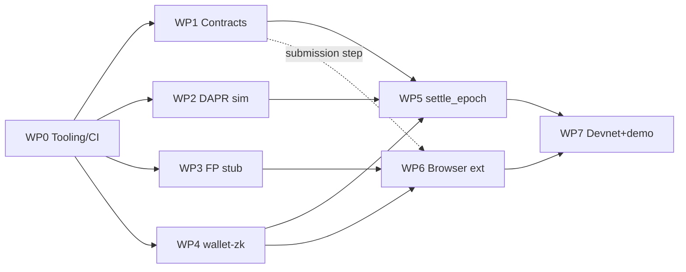

<!-- File: docs/plans/phase1_mvp_music_implementation_plan.md -->

# Phase 1 — MVP (Music): Concrete Implementation Plan

**Status:** In progress (execution started 2026-07-20 on branch `phase1-mvp-music`)
**Scope source:** `ROADMAP.md` Phase 1, detailed against `docs/dev_friendly_spec_v0.2.md` and the specs in `docs/specs/`
**Baseline:** repo state as of commit `518eee7`

> **Language addendum (2026-07-20).** This plan was originally drafted assuming a
> TypeScript/pnpm stack (decision D6) with a Python DAPR simulator (WP2). Per project
> direction, Phase 1 is implemented in **Rust wherever practical**, with two deliberate
> exceptions where "something else is really needed":
> - **Smart contracts stay Solidity on EVM** (decision D1 unchanged; Foundry/Anvil devnet).
> - **The browser extension** uses a **Rust core compiled to WASM** behind a thin JS/MV3 shim.
>
> Everything else — `libs/*`, the DAPR simulator (a Rust crate shared with the settlement
> job as a single source of payout-math truth), the settlement job, and the workspace
> tooling — is Rust (a Cargo workspace, not pnpm). This overrides D6 and the WP2 language
> choice; all other work-package content below stands. See §3 for the amended decisions.

---

## 1. Objective and Exit Criterion

Phase 1 delivers the smallest end-to-end loop of the CWE for music, entirely on a local devnet:

> A user "plays" music in a browser with the CWE extension installed; the extension recognizes the work (via a stub fingerprint lookup), accounts minutes locally, and at epoch end submits a consumption commitment to the chain. An off-chain DAPR job aggregates all commitments, computes payouts, commits the result on-chain, and creators withdraw their split shares.

**Exit criterion (the Phase 1 demo):** one command (`make demo` in `ops/`) runs steps 1–6 of the end-to-end transaction in `docs/dev_friendly_spec_v0.2.md` §11 against a local Anvil/Hardhat node — with the ZK proof replaced by plain commitments (see §3 Decisions) and the Creator Portal replaced by a registration script.

### In scope
- Browser extension: media detection, local accounting, price-threshold policy, FP lookup **stub**, epoch settlement submission
- Contracts: `CWETiers`, `CWERegistry`, `CWEConsumption`, `CWEPayouts` (payout ledger with Merkle commit + split-pay withdraw)
- DAPR simulator: notebook + runnable script, validated against the same fixtures the chain tests use
- Local devnet + tooling: workspace build, tests, CI, `ops/` targets

### Explicitly out of scope (deferred)
- Real perceptual fingerprinting (Phase 2; stub API per `docs/specs/fingerprinting_specification.md` only)
- Real ZK circuits (`docs/specs/zk_usage_proof_requirements.md`) — Phase 1 uses hash commitments with a `verifyProof` seam so circuits can drop in later
- Discovery Hub service, player plugins, arbitration (Phase 2), DMF (Phase 3), governance contracts (Phase 4)
- IPFS/torrent storage integration
- Tier capability tokens (`docs/specs/tier_capability_token_format.md`) — Phase 1 ties tier to the wallet address

---

## 2. Current State (what actually exists)

An audit of the Phase 1 file tree, so estimates below are honest:

| Path | State |
|---|---|
| `clients/browser-ext/manifest.json` | MV3 manifest exists, but points at raw `.ts` files (won't load); no build tooling |
| `clients/browser-ext/src/background.ts` | one `onInstalled` log line |
| `clients/browser-ext/src/content-script.ts` | placeholder comment only |
| `clients/browser-ext/src/zk.ts`, `package.json` | **empty (0 bytes)** |
| `chain/contracts/ICWERegistry.sol` | minimal registry contract, no access control, no split validation |
| `chain/contracts/ICWETiers.sol`, `ICWEConsumption.sol`, `ICWEPayouts.sol` | **empty** |
| `chain/hardhat.config.ts`, `chain/scripts/settle_epoch.ts` | **empty** |
| `libs/fingerprint/src/index.ts` | returns `crypto.randomUUID()` — *non-deterministic*, must be replaced even as a stub |
| `libs/wallet-zk/src/index.ts` | placeholder proof string |
| `libs/*/package.json` | **empty** |
| `sims/dapr_simulation.ipynb` | **empty**; `sims/README.md` has the DAPR formula; `sample_usage.csv` has 4 rows |
| `ops/Makefile` | echo-only TODO targets; `ops/docker-compose.dev.yml` runs Anvil + a nonexistent discovery-hub image |
| Repo root | no `package.json`, no workspace config, no CI |

Conclusion: Phase 1 is a greenfield build against existing specs, not a completion of existing code.

---

## 3. Decisions Required Up Front

These resolve the "Open Questions for Dev" (dev spec §14) far enough to build Phase 1. Each is reversible later; the recommendation is what this plan assumes.

| # | Question | Recommendation for Phase 1 | Rationale |
|---|---|---|---|
| D1 | EVM vs Substrate | **EVM (Solidity + Hardhat + Anvil)** | Repo already has Solidity files, `hardhat.config.ts`, and Anvil in docker-compose; fastest path to a devnet demo |
| D2 | ZK scope | **Hash commitments only** (`commit = keccak256(work_id ‖ minutes ‖ salt)`), no circuits | Circuits are a Phase 2+ effort per `docs/issues/003-zk-benchmarks.md`; keep the `ZK.generateProof/verifyProof` API shape from dev spec §4.1 so circuits are a drop-in |
| D3 | FP format | 256-bit hex ID, `fp:` prefix, per `docs/specs/fingerprinting_specification.md` §4; stub computes SHA-256 over samples | Deterministic, spec-compatible shape; real perceptual FP replaces the internals in Phase 2 |
| D4 | FP → work resolution | **Local static lookup table** shipped with the extension (JSON manifest), behind a `HubClient` interface | Discovery Hub is Phase 2; the interface isolates the swap |
| D5 | Settlement trust model | Single trusted off-chain aggregator (`settle_epoch.ts`) commits a Merkle root; contract only verifies withdrawals against the root | Matches dev spec §5.3; decentralized aggregation is out of scope (`docs/specs/rollup_aggregation_and_settlement_Interface_specification.md` is the later target) |
| D6 | Package manager / language | **Cargo workspace, Rust everywhere except Solidity contracts** (browser extension = Rust→WASM + thin JS/MV3 shim; DAPR sim = Rust crate shared with settlement). *(Amended 2026-07-20; originally pnpm+TypeScript with a Python sim.)* | Project direction: "Rust unless something else is really needed." Solidity/EVM and the browser's JS shim are the two "really needed" exceptions. Sharing the DAPR math as one Rust crate removes the Python↔Rust rounding-drift risk. |

---

## 4. Work Packages

Sizes: **S** ≈ ≤1 day, **M** ≈ 2–3 days, **L** ≈ ~1 week, for one contributor familiar with the stack.

### WP0 — Repo tooling and CI *(M)* — no dependencies

The enabler for everything else.

- Root `package.json` + `pnpm-workspace.yaml` covering `clients/*`, `libs/*`, `chain`
- Shared `tsconfig.base.json`, ESLint + Prettier config
- Fill the empty `package.json` files in `libs/fingerprint`, `libs/wallet-zk`, `clients/browser-ext`
- `chain/`: Hardhat project (`hardhat.config.ts`, toolbox, TypeChain output consumed by `settle_epoch.ts` and the extension)
- Python tooling for `sims/`: `sims/pyproject.toml` (pytest, pandas, jupyter)
- CI (GitHub Actions, `.github/workflows/ci.yml`): lint + typecheck + unit tests for TS packages, `hardhat test`, `pytest` for sims, extension build artifact upload
- **Acceptance:** `pnpm install && pnpm -r build && pnpm -r test` and `pytest sims` pass in CI on a clean clone.

### WP1 — Contracts *(L)* — depends on WP0

Implement the four contracts named in the roadmap. Rename current files to match reality: `I*.sol` become true interfaces in `chain/contracts/interfaces/`, implementations live alongside (`CWETiers.sol`, `CWERegistry.sol`, `CWEConsumption.sol`, `CWEPayouts.sol`). Interfaces follow dev spec §5.1.

1. **`CWETiers`** — tier table (`light|medium|heavy` → monthly fee, per dev spec §4.1); `subscribe(tierId)` payable, records the user's active tier and epoch fee; `feeOf(tierId)` view; owner-settable fees.
2. **`CWERegistry`** — harden the existing draft: `validSplits` check (splits sum to 1e6 ppm, per work-metadata schema in dev spec §10.1), payees payable, re-registration rules (only original registrant may update), `onlyVerifiedCreator` modifier stubbed as an allowlist (real SSI/VC is Phase 3+).
3. **`CWEConsumption`** — `submitConsumption(tierId, workCommitments[], proof)` keyed by `msg.sender`; stores commitments per epoch; one submission per user per epoch; emits `ConsumptionSubmitted`. Proof bytes accepted and forwarded to a `IProofVerifier` hook that Phase 1 implements as accept-all (the D2 seam).
4. **`CWEPayouts`** — epoch lifecycle: `commitEpoch(epochId, merkleRoot, totalCredits)` (aggregator-only), `withdraw(workId, amount, proof[])` verifying a Merkle inclusion proof of `(workId, amount)`, then split-paying payees per registry splits (dev spec §5.4 — but pull-payment safe: use OpenZeppelin `PullPayment` or checks-effects-interactions + reentrancy guard, don't loop raw `.call` as in the sketch).
- Regenerate the (currently empty) `specs/abi/*.json` from build output; add a `pnpm abi:export` script so specs stay in sync.
- **Tests (Hardhat):** unit tests per contract; the fuzz/property cases from dev spec §13 that apply on-chain: splits always disperse the full credited amount, no double-withdraw, no double-submit per epoch.
- **Acceptance:** `hardhat test` green; deploy script (`chain/scripts/deploy.ts`) brings up all four on Anvil and writes addresses to `chain/deployments/localhost.json`.

### WP2 — DAPR simulator *(M)* — depends on WP0 only (parallel with WP1)

The reference implementation of the payout math; the chain settlement must reproduce its numbers.

- `sims/dapr.py`: pure functions implementing the formula in `sims/README.md` / dev spec §5.3 (`V_i = minutes·price·region_factor`, per-user normalization, credit accumulation), aligned with the definitions in `docs/specs/DAPR_usage_aggregation_protocol.md` §4–6.
- `sims/dapr_simulation.ipynb`: fill the empty notebook — loads `sample_usage.csv`, runs `dapr.py`, visualizes allocations.
- Grow `sample_usage.csv` into `sims/fixtures/` with edge-case datasets: single-work users, zero-minute rows, region factors ≠ 1, and a larger randomized set.
- **Property tests (pytest):** for every fixture, `sum(credits) == sum(tier_fees)` (fairness invariant, dev spec §13); allocations non-negative; per-user weights sum to 1.
- Emit a canonical output format `sims/fixtures/*_expected.json` — consumed by WP5 as the cross-check oracle.
- **Acceptance:** `pytest sims` green; notebook runs top-to-bottom.

### WP3 — Fingerprint stub *(S)* — depends on WP0 (parallel)

- Replace the `randomUUID()` placeholder in `libs/fingerprint` with a **deterministic** stub: SHA-256 over the sample buffer, emitted as `fp:<64 hex>` per D3, matching the API shape of dev spec §3.1 (`compute(samples, opts)`, `compare(a,b)` → 1.0 iff equal for the stub).
- Unit tests: determinism (same buffer → same FP), distinctness, format.
- **Acceptance:** package builds and tests pass; API documented in `libs/fingerprint/README.md` with a note that internals are a stub (link `docs/issues/004-fingerprint-tests.md`).

### WP4 — Wallet, commitments & session accounting (`libs/wallet-zk`) *(M)* — depends on WP0; interface-coupled to WP1

- `Wallet`: thin wrapper over an ethers.js signer (address, tier lookup via `CWETiers`, sign) per dev spec §4.1.
- `Commitments`: `commit(workId, minutes, salt)` = keccak256, plus salt management so the user can later open commitments if arbitration needs it.
- `ZK` namespace keeping the spec signatures: `generateProof(usage)` returns a structured placeholder (`{scheme:"none-v0", ...}`), `verifyProof` checks structural validity only. This is the only module the real circuits will replace.
- `SessionStore`: start/addTime/stop/flush per dev spec §1.2–1.3, storage-agnostic (in-memory + a `chrome.storage` adapter for WP5), epoch-aware per `docs/specs/epoch_beacon_specification.md` definitions (Phase 1 epoch = calendar month, no beacon).
- Unit tests: accrual math, flush semantics, commitment determinism.
- **Acceptance:** `pnpm -C libs/wallet-zk test` green; extension and `settle_epoch.ts` both consume it.

### WP5 — Off-chain settlement job *(M)* — depends on WP1, WP2, WP4

- Implement the empty `chain/scripts/settle_epoch.ts`: pull `ConsumptionSubmitted` events for the epoch, open commitments from a local disclosure file (Phase 1 stand-in for ZK-verified aggregates), run DAPR (TypeScript port of `sims/dapr.py`), build the credit Merkle tree, call `CWEPayouts.commitEpoch`, and write per-work withdrawal proofs to `chain/out/epoch-<n>-proofs.json`.
- **Cross-check:** a test runs the TS DAPR against `sims/fixtures/*_expected.json` — TS and Python must agree to fixed-point tolerance; rounding policy documented (credit remainders accrue to an infra dust account, never minted).
- **Acceptance:** integration test on Anvil — register 3 works, 2 users subscribe + submit, settle, both creators withdraw, balances match the simulator's expected output exactly.

### WP6 — Browser extension *(L)* — depends on WP0, WP3, WP4; WP1 only for final submission step

Build order inside the WP:

1. **Build tooling:** Vite (or similar) MV3 build; fix `manifest.json` to point at built JS; dev-reload workflow (`pnpm -C clients/browser-ext dev` per dev spec §12).
2. **Content script:** attach to `<audio>/<video>` elements, tap samples via WebAudio where CORS permits (fallback: hash of media `src` URL fed to the same FP stub — document the limitation), emit play/progress/stop to background per dev spec §1.2.
3. **Background service worker:** `SessionStore` (WP4) on `chrome.storage.local`; `HubClient` interface with the D4 static-manifest resolver (`assets/works.json`, generated from the same fixtures WP2/WP5 use).
4. **Policy engine:** user-set price threshold; on exceed, overlay block UI per dev spec §1.2 (`ui.blockPlayback`).
5. **Settlement flow:** manual "Settle epoch" button in a minimal popup (Phase 1 stands in for the monthly cron): flush sessions → commitments via WP4 → `CWEConsumption.submitConsumption` against the devnet (network + contract addresses configurable in options page).
6. **Security baseline** per dev spec §1.4: minimal host permissions (narrow from the current `<all_urls>` to an opt-in model if MV3 allows within effort), strict CSP.
- **Tests:** unit tests for policy + hub resolution; one Playwright test loading the built extension against a local test page with an `<audio>` element (Chromium is pre-installable in CI).
- **Acceptance:** loading the built extension in Chromium, playing the test page's audio for N seconds, and pressing "Settle" produces an on-chain `ConsumptionSubmitted` event with the expected commitment.

### WP7 — Devnet, demo & docs *(M)* — depends on all above

- `ops/docker-compose.dev.yml`: keep Anvil; **remove** the nonexistent `discovery-hub` image (Phase 2) or replace with a one-file static server hosting the works manifest + demo page.
- `ops/Makefile`: implement `devnet` (compose up + deploy + seed registry from fixtures), `deploy`, `stop`, and new `demo` and `test-e2e` targets.
- E2E script (`ops/demo/run_demo.ts`): scripted version of the exit-criterion demo (§1) — usable headless in CI (drives the same code paths as the extension via `libs/wallet-zk`) with the extension flow documented as the manual variant.
- Docs: `docs/plans/phase1_demo.md` walkthrough; update module READMEs; mark Phase 1 line items in `ROADMAP.md` as they land.
- **Acceptance:** fresh clone → `make -C ops devnet && make -C ops demo` completes steps 1–6 of dev spec §11 and prints matching creator balances; `test-e2e` runs in CI.

---

## 5. Sequencing and Milestones

| Milestone | Contents | Demo at milestone |
|---|---|---|
| **M1 — Foundations** | WP0 + WP3 + WP2 | CI green; simulator reproduces README formula on fixtures |
| **M2 — Chain cycle** | WP1 + WP4 + WP5 | Headless devnet cycle: register → submit → settle → withdraw, balances match simulator |
| **M3 — Client** | WP6 | Extension recognizes test track, blocks over-threshold work, submits consumption |
| **M4 — Phase 1 done** | WP7 | `make demo` end-to-end; ROADMAP Phase 1 checked off |

Critical path: WP0 → WP1 → WP5 → WP7. WP2/WP3/WP4 parallelize; WP6 can start (steps 1–4) as soon as WP3/WP4 exist.

Total effort: roughly **5–7 weeks** for one full-time contributor; M2 and M3 parallelize well across two people (chain vs. client).

---

## 6. Testing Strategy (dev spec §13 applied to Phase 1)

- **Unit:** FP determinism/format; price-threshold policy; SessionStore accrual; commitment construction; per-contract tests.
- **Property:** DAPR fairness invariants in *both* implementations — `Σ allocations == Σ fees`, non-negativity, weight normalization (pytest + TS test on shared fixtures).
- **Differential:** Python simulator vs. TS settlement on identical fixtures (the WP5 oracle).
- **Integration:** full epoch cycle on Anvil (WP5), extension-driven submission (WP6, Playwright).
- **Security (Phase 1 floor):** reentrancy tests on `withdraw`, double-submit/double-withdraw tests, Solidity static analysis (slither) in CI. Full fuzzing and the bounty program remain post-Phase 1 (`docs/issues/001-threat-model.md`).

## 7. Risks

| Risk | Impact | Mitigation |
|---|---|---|
| WebAudio/CORS blocks sample tapping on real sites | Extension can't fingerprint | Phase 1 demo uses a local test page; src-URL fallback documented; real-site capture is a Phase 2 concern alongside real FP |
| Commitment opening (D5 disclosure file) looks like a privacy hole | Misreads of the privacy story | Clearly labeled Phase 1 scaffolding; the `IProofVerifier`/`ZK` seams are the contract that ZK circuits replace; link `docs/specs/zk_usage_proof_requirements.md` in code comments at each seam |
| Rounding drift between Python and TS DAPR | Settlement disputes | Fixed-point integer math (ppm) in both; differential test gate in CI |
| EVM choice hardens prematurely (D1) | Rework if Substrate is chosen later | All client/settlement chain access goes through a thin `ChainClient` interface in `libs/wallet-zk` |

## 8. Tracking

Suggested breakdown into issues mirrors the WPs (one tracking issue per WP, tasks per bullet). Existing issue stubs that Phase 1 touches: `docs/issues/003-zk-benchmarks.md` (D2 seam), `docs/issues/004-fingerprint-tests.md` (WP3).
