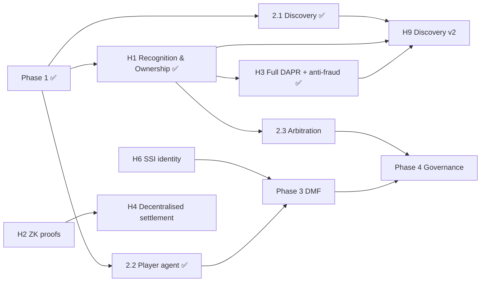

<!-- File: docs/roadmap.md -->

# Clean Web Economy — Development Roadmap

**Status date:** 2026-07-21
**Scope:** the full path from the current devnet MVPs to a production, decentralised
system. The high-level phase list lives in `ROADMAP.md`; this document is the
detailed, status-annotated plan.

---

## 1. Where we are

Six milestones are complete and merged to `main`, each with a one-command
end-to-end demo on a local Anvil devnet.

| Area | Built | Status |
|---|---|---|
| **Contracts** (`chain/`) | `CWETiers`, `CWEConsumption`, `CWEPayouts`, `IProofVerifier`/`AcceptAllVerifier`; `CWERegistry` (+ `content_id`, multi-party consent, registration timestamp); `CWEEscrow` (async dispute flow) + `EarliestRegistrationArbiter`/`IArbiter`; `CWEJury`/`IJury` (committee) | ✅ Phase 1 · H1 · Phase 2·3 |
| **Payout math** (`sims/`) | `cwe-dapr` — user-centric DAPR: diminishing returns, bandwidth-credibility discount, reputation signal; deterministic integer math, fee-conserving | ✅ Phase 1 · H3 |
| **Fingerprint** (`libs/fingerprint`) | Haitsma-Kalker perceptual fingerprint (gain-invariant, Hamming compare), `fp:<hex>` format | ✅ H1 |
| **Client core** (`libs/wallet-zk`) | keccak commitments, `none-v0` ZK seam, epoch session store | ✅ Phase 1 |
| **Settlement** (`services/settlement`) | reads events, opens commitments, runs DAPR, commits Merkle root; routes signed → direct payout, fingerprint → escrow | ✅ Phase 1 · H1 |
| **Browser extension** (`clients/browser-ext`) | Rust→WASM core + MV3 shell; local accounting, price cap, settle flow; two-tier recognition (signed content + fingerprint fallback) | ✅ Phase 1 · H1 |
| **Discovery Hub** (`services/discovery-hub`) | signed, chain-anchored manifest ingest; content-id (Tier 1) + fingerprint nearest-match (Tier 2) resolve; search/trending; OpenAPI | ✅ Phase 2·1 · H1 |
| **Player agent** (`clients/player-plugin`) | native Rust `cwe-player`: symphonia decode → two-tier recognition → price cap → accrual → on-chain settle; `play`/`status`/`settle`/`fingerprint` | ✅ Phase 2·2 |
| **Arbitration jury** (`chain/`) | `CWEJury` committee: owner-appointed jurors, file→vote→finalize, majority verdict moves the escrow, earliest-registration fallback on a tie/silence | ✅ Phase 2·3 |
| **Devnet & demos** (`ops/`) | `make demo`, `make hub-demo`, `make ownership-demo`, `make player-demo`, `make arbitration-demo`, `make antifraud-demo`, CI (rust/contracts/extension/e2e/hub-e2e/ownership-e2e/player-e2e/arbitration-e2e/antifraud-e2e) | ✅ |

### What is real vs. stubbed

The MVPs are honest about their scaffolding. Each stub has a governing spec and a
seam designed for drop-in replacement:

| Concern | MVP today | Target spec |
|---|---|---|
| Usage proofs | keccak hash commitments + disclosure file; accept-all verifier | `zk_usage_proof_requirements.md` |
| Fingerprinting | Haitsma-Kalker perceptual (gain-invariant); production robustness (re-encode, landmark/chromaprint) still to come | `fingerprinting_specification.md` |
| Payout weighting | `minutes·price·region`, largest-remainder split | `DAPR_usage_aggregation_protocol.md` (bandwidth, diminishing returns, diversity) |
| Settlement trust | single trusted aggregator commits a Merkle root | `rollup_aggregation_and_settlement_Interface_specification.md` |
| Storage | none | `client-storage_handshake_specification.md`, `storage_node_policy_and_compliance_specification.md` |
| Identity | verified-creator allowlist | SSI/VC (creator registration, threat models) |
| Tiers | tier tied to wallet address | `tier_capability_token_format.md` |
| Epoch | fixed 30-day window | `epoch_beacon_specification.md` |
| Discovery | resolution + basic search | federation, differential privacy, DAPR-fed ranking, reputation |
| Anti-fraud | fingerprint earnings escrow + challenge window + earliest-registration arbiter (jury seam); tier split still disclosure-asserted | `anti-fraud_and_bandwidth_receipt_protocol.md` |
| Provenance | multi-party consent (each payee EIP-191-signs their share); content-id ownership | signed-exact beats fingerprint; arbitration jury for the residual case |

---

## 2. Roadmap principles

1. **MVP-first, spec-anchored.** Every subsystem lands first as the smallest
   end-to-end slice, then graduates toward its spec. Seams (`IProofVerifier`, the
   `ZK` namespace, `HubClient`, `ChainClient`, `RegistryView`) exist precisely so
   the graduation is a swap, not a rewrite.
2. **One cycle at a time.** Each sub-project gets its own brainstorm → spec → plan
   → subagent-driven build → review → merge cycle (as Phase 1 and Discovery Hub did).
3. **Two parallel tracks.** A **feature track** (new subsystems: player, DMF,
   governance) and a **hardening track** (graduating the stubs to production). They
   interleave; hardening is scheduled by risk and by what the next feature needs.
4. **Devnet green at every step.** `make demo` / `make hub-demo` and CI stay green;
   new subsystems add their own one-command demo.

---

## 3. Forward roadmap

### Feature track

#### Phase 2 — Video & News ✅ *(3 of 3 done)*
- ✅ **2.1 Discovery Hub MVP** — resolution + search over signed manifests.
- ✅ **2.2 Player agent (MVP)** — a native Rust desktop client (`cwe-player`,
  `clients/player-plugin/`) bringing local accounting + fingerprinting outside the
  browser: symphonia decode → two-tier recognition → price cap → accrual → on-chain
  settle (`make ownership-demo`… `make player-demo`). Reuses the Rust core
  (`cwe-fingerprint`, `cwe-wallet-zk`) natively. *Remaining seam:* the actual
  VLC/FFmpeg C module is a thin FFI shim over this agent (deferred); audio-only for
  now (video fingerprinting is its own item).
- ✅ **2.3 Arbitration jury flow (stub)** — the `CWEJury` committee replaces the
  escrow's instant earliest-registration rule with a real file→vote→finalize dispute:
  owner-appointed jurors vote a majority verdict that moves the escrowed money, with
  earliest-registration as the tie/silence fallback. `CWEEscrow` reworked to an async
  dispute (challenge opens a dispute + blocks release; `resolveDispute` applies the
  verdict). `make arbitration-demo` proves a committee overturning a first-registered
  fraudster. *Trust model:* a trusted committee now; the **staked open court**
  (commit-reveal, slashing) is the deferred trustless graduation at the same `IJury`
  seam. *Deferred:* the Rust `services/arbitration/` operator tool + a filing bond.
  *Feeds:* Phase 4 governance.

#### Phase 3 — Distributed Microservice Fabric (DMF)
Creator shops, gigs/commissions, escrow + split-pay, a signed service registry, and
SSI/OIDC auth (`services/creator-portal/`, DMF spec). *Depends on:* SSI/VC identity
(hardening item H6) and the collaborator split/royalty flow (extends `CWERegistry`).

#### Phase 4 — Governance
Member registry + voting contracts, council elections, proposal lifecycle, and
jury-based arbitration promoted from the 2.3 stub. Anchors the DAO that governs the
parameters the hardening track exposes (α/β ranking weights, tier fees, thresholds).

### Hardening track (graduate the stubs)

Scheduled by risk and by feature need, runnable largely in parallel with the feature
track:

- ✅ **H1 — Recognition & Ownership** (`fingerprinting_specification.md`): shipped a
  real Haitsma-Kalker perceptual fingerprint behind the existing
  `Fingerprint::compute`/`compare` API, and — reframed from a pure fingerprint swap
  to a *signing-first* recognition model — added: two-tier recognition (signed
  `content_id` is authoritative and pays directly; a fingerprint match is a cautious
  fallback whose credit is escrowed), multi-party consent provenance in `CWERegistry`
  (each payee EIP-191-signs their exact share), and a `CWEEscrow` + earliest-
  registration `IArbiter` anti-fraud spine (commit → challenge → release), all proven
  by `make ownership-demo`. *Remaining for H3:* production fingerprint robustness
  (re-encode/landmark) and proving the signed-vs-fingerprint tier split rather than
  trusting the disclosure.
- **H2 — ZK usage proofs** (`zk_usage_proof_requirements.md`, `docs/issues/003`):
  real circuits behind the `ZK`/`IProofVerifier` seam, replacing the disclosure file.
  Removes the aggregator's view of raw usage.
- ✅ **H3 — Full DAPR + anti-fraud** (`DAPR_usage_aggregation_protocol.md`,
  `anti-fraud_and_bandwidth_receipt_protocol.md`): `cwe-dapr` now computes the real
  **user-centric** DAPR model — per-user diminishing returns (play count bound in the
  commitment), a bandwidth-credibility discount (neutral default; real receipts = H5),
  and a diversity/reputation signal for discovery — all deterministic integer math,
  fee-conserving, with neutral defaults reproducing the prior payouts bit-for-bit.
  Fraud is structurally capped (extract ≤ pay-in) and becomes a strict loss under low
  bandwidth credibility (`make antifraud-demo`). *Deferred:* real ZK bandwidth
  receipts (H5), reputation→hub-ranking wiring, the staked/global-pool alternatives.
- **H4 — Decentralised settlement** (`rollup_aggregation_and_settlement_Interface_specification.md`):
  move from a single trusted aggregator to a rollup/multi-aggregator model.
- **H5 — Storage layer** (`client-storage_handshake_specification.md`,
  `storage_node_policy_and_compliance_specification.md`): IPFS/torrent content
  distribution + node policy/compliance; the missing piece for real content delivery.
- **H6 — SSI/VC identity**: verifiable creator credentials replacing the allowlist;
  unblocks Phase 3 and hardens registration (`creator_threat_model.md`).
- **H7 — Tier capability tokens** (`tier_capability_token_format.md`): decouple tier
  from the wallet address.
- **H8 — Epoch beacon** (`epoch_beacon_specification.md`): replace the fixed 30-day
  window with a beacon-driven epoch.
- **H9 — Discovery v2**: federation/mirrored indices, k-anonymity + differential
  privacy on aggregates, DAPR-fed ranking, creator reputation.
- **H10 — Security & compliance**: threat-model enforcement (`client_threat_model.md`,
  `creator_threat_model.md`, `docs/issues/001`), `legal_interoperability_guidelines.md`,
  `governance_no-drm_clause.md`, external audit, fuzzing, bounty. Ongoing.

---

## 4. Sequencing and dependencies

Critical enablers: **H1 (recognition & ownership)** ✅ landed the recognition,
provenance, and escrow foundation most of discovery and anti-fraud build on;
**H6 (identity)** gates Phase 3; **H2/H4 (ZK + decentralised settlement)** are the
trust-minimisation backbone but can trail the feature work.

---

## 5. Recommended near-term next steps

Ranked by value-per-effort given what exists. **Phase 2 is complete** (Discovery Hub,
player agent, arbitration jury) and the **DAPR payout model + anti-fraud (H3)** now
lands — so the recognition/provenance/escrow/payout core is in place, and the next
moves are the trust-minimisation backbone, identity, and first Phase 3 groundwork:

1. **H2 — ZK usage proofs.** Replace the disclosure-file stand-in with real circuits
   behind the `IProofVerifier` seam — removes the aggregator's view of raw usage and
   is the prerequisite the whole privacy story leans on.
2. **H6 — SSI/VC identity.** Verifiable creator credentials replacing the allowlist;
   gates **Phase 3 (DMF)** and graduates the jury toward a real, non-allowlisted court.
3. **H5 — Storage layer + real bandwidth receipts.** The peer-to-peer storage/swarm
   that supplies the *real* bandwidth-credibility signal H3 wired as a neutral input —
   turning the anti-fraud "strict loss" from demonstrated to live.
4. **Follow-ons:** the reputation→hub-ranking wiring (H3 fast-follow); the player
   agent's VLC/FFmpeg C module + video fingerprinting; the trustless staked jury.

Each becomes its own spec → plan → build cycle. This document is updated as items land.
