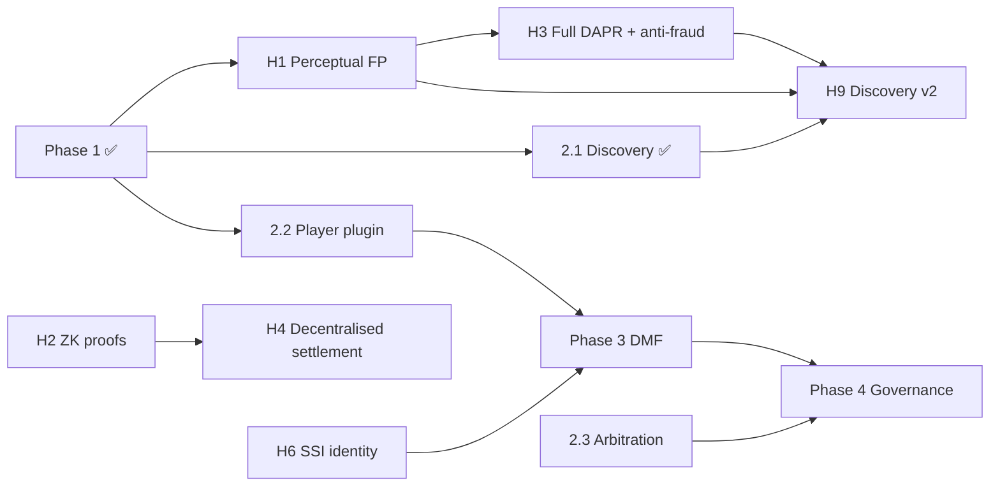

<!-- File: docs/roadmap.md -->

# Clean Web Economy — Development Roadmap

**Status date:** 2026-07-21
**Scope:** the full path from the current devnet MVPs to a production, decentralised
system. The high-level phase list lives in `ROADMAP.md`; this document is the
detailed, status-annotated plan.

---

## 1. Where we are

Two milestones are complete and merged to `main`, each with a one-command
end-to-end demo on a local Anvil devnet.

| Area | Built | Status |
|---|---|---|
| **Contracts** (`chain/`) | `CWETiers`, `CWERegistry`, `CWEConsumption`, `CWEPayouts`, `IProofVerifier`/`AcceptAllVerifier` | ✅ Phase 1 |
| **Payout math** (`sims/`) | `cwe-dapr` — weighted split, ppm integer math, fixtures | ✅ Phase 1 |
| **Fingerprint** (`libs/fingerprint`) | deterministic SHA-256 stub, `fp:` format | ✅ stub |
| **Client core** (`libs/wallet-zk`) | keccak commitments, `none-v0` ZK seam, epoch session store | ✅ Phase 1 |
| **Settlement** (`services/settlement`) | reads events, opens commitments, runs DAPR, commits Merkle root, writes proofs | ✅ Phase 1 |
| **Browser extension** (`clients/browser-ext`) | Rust→WASM core + MV3 shell; local accounting, price cap, settle flow | ✅ Phase 1 |
| **Discovery Hub** (`services/discovery-hub`) | signed, chain-anchored manifest ingest; resolve/search/trending; OpenAPI | ✅ Phase 2·1 |
| **Devnet & demos** (`ops/`) | `make demo`, `make hub-demo`, CI (rust/contracts/extension/e2e/hub-e2e) | ✅ |

### What is real vs. stubbed

The MVPs are honest about their scaffolding. Each stub has a governing spec and a
seam designed for drop-in replacement:

| Concern | MVP today | Target spec |
|---|---|---|
| Usage proofs | keccak hash commitments + disclosure file; accept-all verifier | `zk_usage_proof_requirements.md` |
| Fingerprinting | SHA-256 of sample/URL bytes (not perceptual) | `fingerprinting_specification.md` |
| Payout weighting | `minutes·price·region`, largest-remainder split | `DAPR_usage_aggregation_protocol.md` (bandwidth, diminishing returns, diversity) |
| Settlement trust | single trusted aggregator commits a Merkle root | `rollup_aggregation_and_settlement_Interface_specification.md` |
| Storage | none | `client-storage_handshake_specification.md`, `storage_node_policy_and_compliance_specification.md` |
| Identity | verified-creator allowlist | SSI/VC (creator registration, threat models) |
| Tiers | tier tied to wallet address | `tier_capability_token_format.md` |
| Epoch | fixed 30-day window | `epoch_beacon_specification.md` |
| Discovery | resolution + basic search | federation, differential privacy, DAPR-fed ranking, reputation |
| Anti-fraud | none | `anti-fraud_and_bandwidth_receipt_protocol.md` |

---

## 2. Roadmap principles

1. **MVP-first, spec-anchored.** Every subsystem lands first as the smallest
   end-to-end slice, then graduates toward its spec. Seams (`IProofVerifier`, the
   `ZK` namespace, `HubClient`, `ChainClient`, `RegistryView`) exist precisely so
   the graduation is a swap, not a rewrite.
2. **One cycle at a time.** Each sub-project gets its own brainstorm → spec → plan
   → subagent-driven build → review → merge cycle (as Phase 1 and Discovery Hub did).
3. **Two parallel tracks.** A **feature track** (new subsystems: player, DMF,
   governance) and a **hardening track** (graduating the stubs to production). They
   interleave; hardening is scheduled by risk and by what the next feature needs.
4. **Devnet green at every step.** `make demo` / `make hub-demo` and CI stay green;
   new subsystems add their own one-command demo.

---

## 3. Forward roadmap

### Feature track

#### Phase 2 — Video & News *(1 of 3 done)*
- ✅ **2.1 Discovery Hub MVP** — resolution + search over signed manifests.
- ⬜ **2.2 Player plugin (VLC/FFmpeg)** — a native desktop client that brings local
  accounting + fingerprinting to video/audio outside the browser. Reuses the Rust
  core (`cwe-fingerprint`, `cwe-wallet-zk`) via FFI/WASM behind a C plugin shim
  (`clients/player-plugin/`). *Depends on:* nothing new; extends the Phase 1 client
  surface. *Unblocks:* video usage feeding DAPR/discovery.
- ⬜ **2.3 Arbitration jury flow (stub)** — dispute filing, juror selection, voting,
  resolution (`services/arbitration/`), with contract hooks. *Depends on:* identity
  primitives (can start with the allowlist stub). *Feeds:* Phase 4 governance.

#### Phase 3 — Distributed Microservice Fabric (DMF)
Creator shops, gigs/commissions, escrow + split-pay, a signed service registry, and
SSI/OIDC auth (`services/creator-portal/`, DMF spec). *Depends on:* SSI/VC identity
(hardening item H6) and the collaborator split/royalty flow (extends `CWERegistry`).

#### Phase 4 — Governance
Member registry + voting contracts, council elections, proposal lifecycle, and
jury-based arbitration promoted from the 2.3 stub. Anchors the DAO that governs the
parameters the hardening track exposes (α/β ranking weights, tier fees, thresholds).

### Hardening track (graduate the stubs)

Scheduled by risk and by feature need, runnable largely in parallel with the feature
track:

- **H1 — Perceptual fingerprinting** (`fingerprinting_specification.md`): replace the
  SHA-256 stub with an audio landmark/chromaprint pipeline behind the existing
  `Fingerprint::compute`/`compare` API. *High value* — it is what makes recognition
  and duplicate detection real. Prereq for meaningful discovery dedup.
- **H2 — ZK usage proofs** (`zk_usage_proof_requirements.md`, `docs/issues/003`):
  real circuits behind the `ZK`/`IProofVerifier` seam, replacing the disclosure file.
  Removes the aggregator's view of raw usage.
- **H3 — Full DAPR + anti-fraud** (`DAPR_usage_aggregation_protocol.md`,
  `anti-fraud_and_bandwidth_receipt_protocol.md`): bandwidth credibility, per-user
  diminishing returns, diversity weighting, Sybil resistance. Feeds discovery ranking.
- **H4 — Decentralised settlement** (`rollup_aggregation_and_settlement_Interface_specification.md`):
  move from a single trusted aggregator to a rollup/multi-aggregator model.
- **H5 — Storage layer** (`client-storage_handshake_specification.md`,
  `storage_node_policy_and_compliance_specification.md`): IPFS/torrent content
  distribution + node policy/compliance; the missing piece for real content delivery.
- **H6 — SSI/VC identity**: verifiable creator credentials replacing the allowlist;
  unblocks Phase 3 and hardens registration (`creator_threat_model.md`).
- **H7 — Tier capability tokens** (`tier_capability_token_format.md`): decouple tier
  from the wallet address.
- **H8 — Epoch beacon** (`epoch_beacon_specification.md`): replace the fixed 30-day
  window with a beacon-driven epoch.
- **H9 — Discovery v2**: federation/mirrored indices, k-anonymity + differential
  privacy on aggregates, DAPR-fed ranking, creator reputation.
- **H10 — Security & compliance**: threat-model enforcement (`client_threat_model.md`,
  `creator_threat_model.md`, `docs/issues/001`), `legal_interoperability_guidelines.md`,
  `governance_no-drm_clause.md`, external audit, fuzzing, bounty. Ongoing.

---

## 4. Sequencing and dependencies

Critical enablers: **H1 (perceptual fingerprinting)** unlocks most of discovery and
anti-fraud value; **H6 (identity)** gates Phase 3; **H2/H4 (ZK + decentralised
settlement)** are the trust-minimisation backbone but can trail the feature work.

---

## 5. Recommended near-term next steps

Ranked by value-per-effort given what exists:

1. **H1 — Perceptual fingerprinting.** The single highest-leverage item: the whole
   system's premise (recognise a work, credit the creator) is only as real as the
   fingerprint. It slots behind an API that already exists and immediately makes the
   Discovery Hub's duplicate detection and the client's recognition meaningful.
2. **Phase 2.2 — Player plugin.** Extends paid consumption to desktop video/audio,
   broadening the demo from "browser only" to real media players, and reuses the
   entire Rust core.
3. **Phase 2.3 — Arbitration stub**, then **Phase 3 (DMF)** once **H6 (identity)** is
   in place.

Each becomes its own spec → plan → build cycle. This document is updated as items land.
