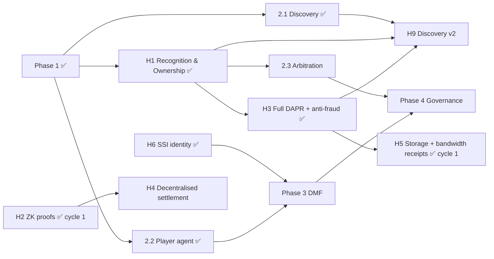

<!-- File: docs/roadmap.md -->

# Clean Web Economy — Development Roadmap

**Status date:** 2026-07-25
**Scope:** the full path from the current devnet MVPs to a production, decentralised
system. The high-level phase list lives in `ROADMAP.md`; this document is the
detailed, status-annotated plan.

---

## 1. Where we are

Nine milestones are complete and merged to `main`, each with a one-command
end-to-end demo on a local Anvil devnet.

| Area | Built | Status |
|---|---|---|
| **Contracts** (`chain/`) | `CWETiers`, `CWEConsumption`, `CWEPayouts`, `IProofVerifier`/`AcceptAllVerifier`/`Groth16Verifier` (real BN254 pairing check); `CWEEpochBeacon` (published per-epoch key); `CWERegistry` (+ `content_id`, multi-party consent, registration timestamp); `CWEEscrow` (async dispute flow) + `EarliestRegistrationArbiter`/`IArbiter`; `CWEJury`/`IJury` (committee); `CWEIdentity`/`ICWEIdentity` (verifiable credentials) | ✅ Phase 1 · H1 · Phase 2·3 · H6 · H2 |
| **Payout math** (`sims/`) | `cwe-dapr` — user-centric DAPR: diminishing returns, bandwidth-credibility discount (now real per-(user, work) credibility from verified receipts, neutral default when absent), reputation signal; deterministic integer math, fee-conserving | ✅ Phase 1 · H3 · H5 |
| **Fingerprint** (`libs/fingerprint`) | Haitsma-Kalker perceptual fingerprint (gain-invariant, Hamming compare), `fp:<hex>` format | ✅ H1 |
| **Client core** (`libs/wallet-zk`) | keccak commitments, Poseidon commitments shared with the ZK circuit, `none-v0` ZK seam, epoch session store | ✅ Phase 1 · H2 |
| **ZK usage circuits** (`libs/zk-circuits`) | Groth16/BN254 circuit proving usage is well-formed, range-bounded, diminishing-returns-capped, epoch-bound, and per-work-unique; Poseidon commitments/pseudonyms/digest; devnet trusted-setup + prover; EVM proof-point export | ✅ H2 (cycle 1) |
| **Bandwidth receipts** (`libs/receipt`) | `cwe-receipt` — the co-signed `Receipt` tuple (work, consumer, node, bytes, epoch, session/chunk nonces), RFC 8785 canonical bytes, EIP-191 sign/recover, anti-replay dedup key; portable, shared by the storage node, the consumer, and settlement | ✅ H5 (cycle 1) |
| **Storage** (`services/storage`) | `cwe-storage` — a minimal HTTP node serving real content fragments, a byte-accounting ledger keyed by (session, chunk), and receipt co-signing against its own ledger (never a caller-supplied count) | ✅ H5 (cycle 1) |
| **Settlement** (`services/settlement`) | reads events, opens commitments, runs DAPR, commits Merkle root; routes signed → direct payout, fingerprint → escrow; dual-mode: legacy disclosure-file path (pre-ZK demos) or event mode paying from Groth16-proven usage weights (`make zk-demo`); event mode also verifies a co-signed receipts bundle to compute real per-(user, work) bandwidth credibility (`make bandwidth-demo`) | ✅ Phase 1 · H1 · H2 · H5 |
| **Browser extension** (`clients/browser-ext`) | Rust→WASM core + MV3 shell; local accounting, price cap, settle flow; two-tier recognition (signed content + fingerprint fallback) | ✅ Phase 1 · H1 |
| **Discovery Hub** (`services/discovery-hub`) | signed, chain-anchored manifest ingest; content-id (Tier 1) + fingerprint nearest-match (Tier 2) resolve; search/trending; OpenAPI | ✅ Phase 2·1 · H1 |
| **Player agent** (`clients/player-plugin`) | native Rust `cwe-player`: symphonia decode → two-tier recognition → price cap → accrual → on-chain settle; `play`/`status`/`settle`/`fingerprint` | ✅ Phase 2·2 |
| **Arbitration jury** (`chain/`) | `CWEJury` committee: owner-appointed jurors, file→vote→finalize, majority verdict moves the escrow, earliest-registration fallback on a tie/silence | ✅ Phase 2·3 |
| **Devnet & demos** (`ops/`) | `make demo`, `make hub-demo`, `make ownership-demo`, `make player-demo`, `make arbitration-demo`, `make antifraud-demo`, `make identity-demo`, `make zk-demo`, `make bandwidth-demo`, CI (rust/contracts/extension/e2e/hub-e2e/ownership-e2e/player-e2e/arbitration-e2e/antifraud-e2e/identity-e2e/zk-e2e/bandwidth-e2e) | ✅ |

### What is real vs. stubbed

The MVPs are honest about their scaffolding. Each stub has a governing spec and a
seam designed for drop-in replacement:

| Concern | MVP today | Target spec |
|---|---|---|
| Usage proofs | real Groth16/BN254 integrity proof + within-epoch dedup, verified on-chain (`Groth16Verifier`); settlement pays from proven event weights (event mode). Disclosure file retained as the legacy path for the pre-ZK demos (dual-mode) | `zk_usage_proof_requirements.md` |
| Fingerprinting | Haitsma-Kalker perceptual (gain-invariant); production robustness (re-encode, landmark/chromaprint) still to come | `fingerprinting_specification.md` |
| Payout weighting | `minutes·price·region`, largest-remainder split | `DAPR_usage_aggregation_protocol.md` (bandwidth, diminishing returns, diversity) |
| Settlement trust | single trusted aggregator commits a Merkle root | `rollup_aggregation_and_settlement_Interface_specification.md` |
| Storage | a single real `cwe-storage` HTTP node serving actual content bytes and co-signing receipts against its own serving ledger; swarm distribution, redundancy, availability/proof-of-storage, and node discovery are still to come | `client-storage_handshake_specification.md`, `storage_node_policy_and_compliance_specification.md` |
| Identity | ✅ verifiable credentials (issuer set, attest/revoke, expiry) via `CWEIdentity`; real eID/proof-of-personhood/OIDC/DID-JSON-LD still to come | SSI/VC (creator registration, threat models) |
| Tiers | tier tied to wallet address | `tier_capability_token_format.md` |
| Epoch | fixed 30-day window | `epoch_beacon_specification.md` |
| Discovery | resolution + basic search | federation, differential privacy, DAPR-fed ranking, reputation |
| Anti-fraud | fingerprint earnings escrow + challenge window + earliest-registration arbiter (jury seam); tier split still disclosure-asserted; a claim of usage backed by zero co-signed bytes is now a live strict loss (real per-(user, work) bandwidth credibility from verified receipts, not a hand-set demo value) | `anti-fraud_and_bandwidth_receipt_protocol.md` |
| Provenance | multi-party consent (each payee EIP-191-signs their share); content-id ownership | signed-exact beats fingerprint; arbitration jury for the residual case |

---

## 2. Roadmap principles

1. **MVP-first, spec-anchored.** Every subsystem lands first as the smallest
   end-to-end slice, then graduates toward its spec. Seams (`IProofVerifier`, the
   `ZK` namespace, `HubClient`, `ChainClient`, `RegistryView`) exist precisely so
   the graduation is a swap, not a rewrite.
2. **One cycle at a time.** Each sub-project gets its own brainstorm → spec → plan
   → subagent-driven build → review → merge cycle (as Phase 1 and Discovery Hub did).
3. **Two parallel tracks.** A **feature track** (new subsystems: player, DMF,
   governance) and a **hardening track** (graduating the stubs to production). They
   interleave; hardening is scheduled by risk and by what the next feature needs.
4. **Devnet green at every step.** `make demo` / `make hub-demo` and CI stay green;
   new subsystems add their own one-command demo.

---

## 3. Forward roadmap

### Feature track

#### Phase 2 — Video & News ✅ *(3 of 3 done)*
- ✅ **2.1 Discovery Hub MVP** — resolution + search over signed manifests.
- ✅ **2.2 Player agent (MVP)** — a native Rust desktop client (`cwe-player`,
  `clients/player-plugin/`) bringing local accounting + fingerprinting outside the
  browser: symphonia decode → two-tier recognition → price cap → accrual → on-chain
  settle (`make ownership-demo`… `make player-demo`). Reuses the Rust core
  (`cwe-fingerprint`, `cwe-wallet-zk`) natively. *Remaining seam:* the actual
  VLC/FFmpeg C module is a thin FFI shim over this agent (deferred); audio-only for
  now (video fingerprinting is its own item).
- ✅ **2.3 Arbitration jury flow (stub)** — the `CWEJury` committee replaces the
  escrow's instant earliest-registration rule with a real file→vote→finalize dispute:
  owner-appointed jurors vote a majority verdict that moves the escrowed money, with
  earliest-registration as the tie/silence fallback. `CWEEscrow` reworked to an async
  dispute (challenge opens a dispute + blocks release; `resolveDispute` applies the
  verdict). `make arbitration-demo` proves a committee overturning a first-registered
  fraudster. *Trust model:* a trusted committee now; the **staked open court**
  (commit-reveal, slashing) is the deferred trustless graduation at the same `IJury`
  seam. *Deferred:* the Rust `services/arbitration/` operator tool + a filing bond.
  *Feeds:* Phase 4 governance.

#### Phase 3 — Distributed Microservice Fabric (DMF)
Creator shops, gigs/commissions, escrow + split-pay, a signed service registry, and
SSI/OIDC auth (`services/creator-portal/`, DMF spec). *Depends on:* SSI/VC identity
(hardening item H6) and the collaborator split/royalty flow (extends `CWERegistry`).

#### Phase 4 — Governance
Member registry + voting contracts, council elections, proposal lifecycle, and
jury-based arbitration promoted from the 2.3 stub. Anchors the DAO that governs the
parameters the hardening track exposes (α/β ranking weights, tier fees, thresholds).

### Hardening track (graduate the stubs)

Scheduled by risk and by feature need, runnable largely in parallel with the feature
track:

- ✅ **H1 — Recognition & Ownership** (`fingerprinting_specification.md`): shipped a
  real Haitsma-Kalker perceptual fingerprint behind the existing
  `Fingerprint::compute`/`compare` API, and — reframed from a pure fingerprint swap
  to a *signing-first* recognition model — added: two-tier recognition (signed
  `content_id` is authoritative and pays directly; a fingerprint match is a cautious
  fallback whose credit is escrowed), multi-party consent provenance in `CWERegistry`
  (each payee EIP-191-signs their exact share), and a `CWEEscrow` + earliest-
  registration `IArbiter` anti-fraud spine (commit → challenge → release), all proven
  by `make ownership-demo`. *Remaining for H3:* production fingerprint robustness
  (re-encode/landmark) and proving the signed-vs-fingerprint tier split rather than
  trusting the disclosure.
- ✅ **H2 — ZK usage proofs (cycle 1)** (`zk_usage_proof_requirements.md`,
  `docs/issues/003`): a real Groth16/BN254 usage-proof circuit
  (`libs/zk-circuits`) behind the `IProofVerifier` seam, verified on-chain by a
  real `Groth16Verifier` (replaces `AcceptAllVerifier` on the default deploy),
  a `CWEEpochBeacon` publishing the per-epoch key, and Poseidon commitments
  shared between the client and circuit. Settlement is dual-mode: event mode
  pays from the proven per-work weights carried on-chain by the proof (the
  aggregator never sees raw usage); the disclosure file remains the legacy
  path so the four pre-ZK demos and the player keep working unmodified.
  Integrity-first: usage is provably well-formed, range-bounded,
  diminishing-returns-capped, epoch-bound, and per-work-unique
  (`make zk-demo` — honest usage pays, inflation and row-splitting are
  rejected on-chain/in-circuit). *Deferred to a later cycle:* work-identity
  blinding (hiding *which* works a user consumed), a manifest-signature
  circuit, a tier-eligibility circuit, cross-epoch unlinkability, a real
  randomness beacon (VRF/drand — `CWEEpochBeacon`'s key today is
  operator-published, not randomness-backed), and migrating the four legacy
  demos plus the player off the disclosure path onto real proofs.
- ✅ **H3 — Full DAPR + anti-fraud** (`DAPR_usage_aggregation_protocol.md`,
  `anti-fraud_and_bandwidth_receipt_protocol.md`): `cwe-dapr` now computes the real
  **user-centric** DAPR model — per-user diminishing returns (play count bound in the
  commitment), a bandwidth-credibility discount (neutral default; real receipts = H5),
  and a diversity/reputation signal for discovery — all deterministic integer math,
  fee-conserving, with neutral defaults reproducing the prior payouts bit-for-bit.
  Fraud is structurally capped (extract ≤ pay-in) and becomes a strict loss under low
  bandwidth credibility (`make antifraud-demo`, now live via H5). *Deferred:* real ZK
  bandwidth receipts, reputation→hub-ranking wiring, the staked/global-pool alternatives.
- **H4 — Decentralised settlement** (`rollup_aggregation_and_settlement_Interface_specification.md`):
  move from a single trusted aggregator to a rollup/multi-aggregator model.
- ✅ **H5 — Storage layer + real bandwidth receipts (cycle 1)**
  (`client-storage_handshake_specification.md`,
  `storage_node_policy_and_compliance_specification.md`,
  `anti-fraud_and_bandwidth_receipt_protocol.md`): a minimal `cwe-storage` node serves
  real content bytes and holds a CWEIdentity storage-node credential; a consumer
  downloads and co-signs a bandwidth receipt per chunk (`cwe-receipt`); settlement's
  event mode verifies both signatures, the node credential, and anti-replay, then
  computes a real per-(user, work) bandwidth credibility that feeds `cwe_dapr`'s
  per-row discount (neutral when a receipts bundle is absent, so the legacy demos are
  bit-for-bit unchanged). `RATE(W)` — the "bytes per unit weight" expectation — is an
  aggregator deploy-config constant this cycle, fails closed (credibility 0) on a
  missing/zero rate rather than failing open, and is never read from the receipts
  bundle. `make bandwidth-demo` proves three things end to end: an honest download
  pays in full; a puppet-work claim backed by zero bytes is now a live strict loss (fee
  burned, claimant earns nothing); and a node lacking the storage-node credential has
  its receipts rejected outright. *Deferred:* a ZK bandwidth proof (hide which
  works/peers and per-work bytes), a peer-diversity proof, the full P2P storage swarm
  (distribution, redundancy, availability/proof-of-storage, node discovery), node
  compliance & staking/slashing, ephemeral-key unlinkability (cycle 1 uses stable
  credentialed node keys), and `RATE(W)` graduating from deploy config to a
  manifest/registry field — which needs a protocol-level floor to keep it
  beneficiary-independent (spec §4.1). *Known limitation, not closed this cycle:*
  because `expected_bytes = weight · RATE(W) / 1e12` floors to a minimum of one byte,
  a claim with a very small claimed weight reaches full credibility after verifying a
  single byte — and because the payout target is scale-invariant, that single-row
  claimant still recovers 100% of their own fee, the same as an honest claimant who
  must move ~960 KB for the same credit. This is a *deterrent* gap, not a
  money-extraction one: the "extract ≤ pay-in" cap still holds (a claimant only ever
  recovers their own fee) and a credentialed node must still genuinely serve and
  co-sign that byte. Closing it needs an absolute floor on expected bytes per claim, or
  weight-magnitude sensitivity in the payout target — deferred as a spec-level decision
  to a later cycle. *Also found in review, also deferred:* the ledger this node signs
  from records bytes **read off disk and handed to the response writer**, not bytes
  actually delivered, and the receipt binds no byte range — so a modified consumer can
  issue `GET /content/...` requests, never read the response, and still obtain a
  node-signed receipt for the full count, then repeat under a fresh chunk nonce (the
  anti-replay key is entirely client-chosen) to accumulate verified bytes far beyond
  the file's real size. This is strictly cheaper than the dust-weight gap above — it
  needs no dust-sized weight, just repeated fetch-and-discard — but it is likewise a
  deterrent gap, not a money-extraction one (same scale-invariant-target, same
  credentialed-node requirement). The fix is to bind `offset`/`len` into the receipt,
  dedup by byte range per (user, work), and write the ledger entry only after the body
  is written; not attempted this cycle. Two smaller items also surfaced: `fragment`
  (`services/storage/src/lib.rs`) reads a work's ENTIRE content file into memory via
  `std::fs::read` regardless of the requested window, a memory-exhaustion vector under
  concurrent requests that must be fixed before any node is publicly reachable; and
  settlement's event-mode chain layer (`services/settlement/src/chain.rs`) resolves
  each distinct node's on-chain credential BEFORE checking any receipt signature, with
  an RPC error aborting settlement — harmless while receipt bundles are
  operator-supplied local files, but a live denial-of-service once consumers submit
  bundles directly; fix is to verify signatures first and resolve credentials only for
  surviving nodes.
- ✅ **H6 — SSI/VC identity**: `CWEIdentity` — a rotatable issuer set grants revocable,
  expiring verifiable credentials; the registry and jury gate on `isValid` instead of
  owner allowlists (both removed). Removing an issuer invalidates all their credentials
  (`make identity-demo`). Unblocks Phase 3 and hardens registration
  (`creator_threat_model.md`). *Deferred:* real eID/eIDAS, proof-of-personhood, OIDC,
  W3C DID/JSON-LD, holder-carried wallet-VCs, org hierarchies, governance-curated issuers.
- **H7 — Tier capability tokens** (`tier_capability_token_format.md`): decouple tier
  from the wallet address.
- **H8 — Epoch beacon** (`epoch_beacon_specification.md`): replace the fixed 30-day
  window with a beacon-driven epoch.
- **H9 — Discovery v2**: federation/mirrored indices, k-anonymity + differential
  privacy on aggregates, DAPR-fed ranking, creator reputation.
- **H10 — Security & compliance**: threat-model enforcement (`client_threat_model.md`,
  `creator_threat_model.md`, `docs/issues/001`), `legal_interoperability_guidelines.md`,
  `governance_no-drm_clause.md`, external audit, fuzzing, bounty. Ongoing.

---

## 4. Sequencing and dependencies

```mermaid
flowchart LR
  P1[Phase 1 ✅] --> P21[2.1 Discovery ✅]
  P1 --> P22[2.2 Player agent ✅]
  P1 --> H1[H1 Recognition & Ownership ✅]
  P21 --> H9[H9 Discovery v2]
  H1 --> H9
  H1 --> H3[H3 Full DAPR + anti-fraud ✅]
  H1 --> P23[2.3 Arbitration ✅]
  H3 --> H9
  H3 --> H5[H5 Storage + bandwidth receipts ✅ cycle 1]
  H6[H6 SSI identity ✅] --> P3[Phase 3 DMF]
  P22 --> P3
  H2[H2 ZK proofs ✅ cycle 1] --> H4[H4 Decentralised settlement]
  P23[2.3 Arbitration] --> P4[Phase 4 Governance]
  P3 --> P4
```

Critical enablers: **H1 (recognition & ownership)** ✅, **H6 (identity)** ✅, and now
**H2 (ZK usage proofs, cycle 1)** ✅ are in — recognition/provenance/escrow plus a
credential layer that gates registration and graduates the jury (unblocking
**Phase 3**), and a real integrity proof replacing the disclosure file's trust
assumption for usage. **H5 (storage + real bandwidth receipts, cycle 1)** ✅ turns H3's
neutral bandwidth-credibility input live, off the same DAPR seam. **H4 (decentralised
settlement)** is the remaining trust-minimisation piece, and a second H2 cycle
(work-identity blinding, the manifest/tier circuits, cross-epoch unlinkability, a real
beacon, and migrating the legacy demos) can trail the feature work.

---

## 5. Recommended near-term next steps

Ranked by value-per-effort given what exists. **Phase 2 is complete** (Discovery Hub,
player agent, arbitration jury); **H3 (DAPR + anti-fraud)**, **H6 (identity)**,
**H2 cycle 1 (ZK usage proofs)**, and now **H5 cycle 1 (storage + real bandwidth
receipts)** have landed — so the recognition/provenance/escrow/payout core, a
credential layer, a real on-chain integrity proof for usage, and a live bandwidth-
credibility signal are all in place, and the next moves are first Phase 3 groundwork
and the remaining trust-minimisation items:

1. **Phase 3 — Creator DMF.** Now unblocked by H6 identity: creator shops, gigs,
   split-pay, a signed service registry, SSI/OIDC auth.
2. **H2 — cycle 2 (deferred from cycle 1).** Work-identity blinding (hide *which*
   works a user consumed), a manifest-signature circuit, a tier-eligibility circuit,
   cross-epoch unlinkability, a real randomness beacon (VRF/drand) for
   `CWEEpochBeacon`, and migrating the four legacy demos plus the player off the
   disclosure path onto real proofs.
3. **H5 — cycle 2 (deferred from cycle 1).** Scoped and prioritised by the two
   deterrent gaps cycle 1 documented rather than closed — both agreed for this cycle:
   an **absolute floor on expected bytes** per claim (or weight-magnitude sensitivity
   in the payout target), so a dust-weight claim cannot reach full credibility off a
   single byte; and **binding `offset`/`len` into the receipt** with per-range dedup,
   plus writing the node's ledger entry only after the response body is flushed, so
   receipts attest bytes *delivered* rather than bytes *read* and cannot be minted by
   fetch-and-discard. Alongside those: the ZK bandwidth proof (hide which works/peers
   and per-work bytes), a peer-diversity proof, the full P2P storage swarm, node
   compliance & staking/slashing, ephemeral-key unlinkability, and graduating
   `RATE(W)` from deploy config to a manifest/registry field with a protocol floor.
4. **H4 — Decentralised settlement.** Rollup/multi-aggregator model, now that event
   mode gives the aggregator a proof-backed usage signal to build on.
5. **Follow-ons:** the reputation→hub-ranking wiring (H3 fast-follow); the player
   agent's VLC/FFmpeg C module + video fingerprinting; the trustless staked jury.

Each becomes its own spec → plan → build cycle. This document is updated as items land.
